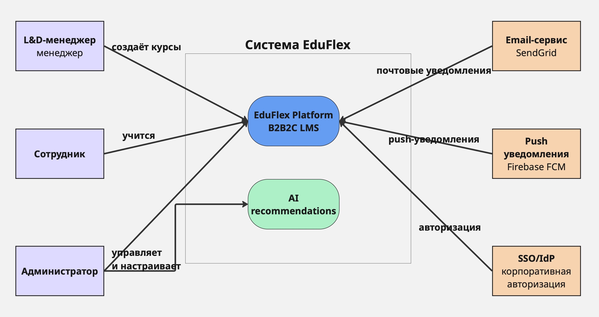
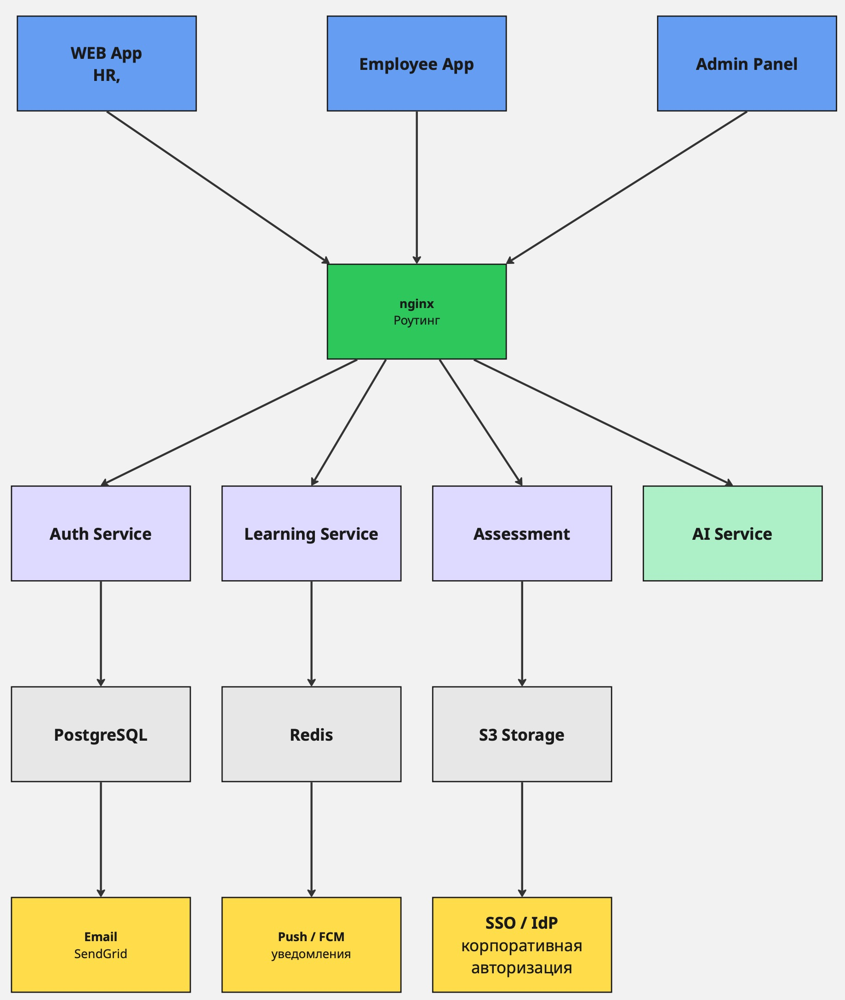

# C4 Level 1 — System Context

# C4 Level 2 — Containers

## Стек технологий EduFlex MVP

### Frontend
**React (SPA) + Next.js (Admin Panel)**
React — стандарт для SPA с богатой экосистемой; Next.js для Admin Panel даёт серверный рендеринг и быстрый старт с готовым роутингом. Оба написаны на TypeScript — это снижает класс ошибок в сложной доменной логике (курсы, треки, тесты).

### Backend
**Node.js + Express (или Fastify)**
Node.js — оптимален для I/O-heavy нагрузки (много параллельных запросов пользователей). Express или Fastify дают быстрое построение REST API. Один язык на фронте и бэке сокращает контекстные переключения для небольшой команды MVP.

### База данных
**PostgreSQL**
Реляционная модель хорошо ложится на доменную структуру EduFlex: пользователи, назначения, курсы, прогресс — сущности с чёткими связями. PostgreSQL поддерживает JSON-поля для гибкого хранения ответов тестов без отдельных таблиц.

**Redis**
Кэш сессий и токенов (JWT blacklist), очереди для фоновых задач (рассылка уведомлений). Снижает нагрузку на PostgreSQL при частых проверках прав доступа.

### Хранилище медиаконтента
**AWS S3 (или аналог)**
Видео-уроки и файлы курсов не должны лежать в БД. S3 даёт дешёвое и масштабируемое хранилище с CDN-раздачей через CloudFront.

### AI / рекомендации
**Python (FastAPI) + лёгкая ML-модель**
AI-сервис выделен отдельно. Python — стандарт для ML-задач. Для MVP достаточно контентной фильтрации (collaborative filtering) — без тяжёлых LLM. FastAPI даёт асинхронный REST за минимальные усилия.

### Инфраструктура
**Docker + Docker Compose (MVP) → Kubernetes (масштабирование)**
Docker позволяет запустить весь стек одной командой и обеспечивает идентичность dev/prod окружений. Kubernetes — естественный следующий шаг при росте нагрузки.

### Уведомления
**Firebase FCM** (push) + **SendGrid** (email) — готовые managed-сервисы без поддержки собственной инфраструктуры.

### Авторизация
**JWT + опциональный SSO (OAuth2/SAML)**
JWT — для собственной авторизации сотрудников; SSO-интеграция позволяет B2B-клиентам подключать корпоративные IdP (Google Workspace, Azure AD) без создания отдельных аккаунтов.